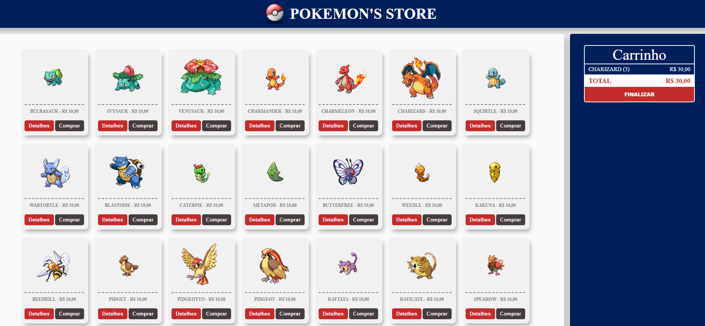

<h1 align="center">
    Pokemon's Store
</h1>

<h1 align="center">

  </h1>

<h3 align="center">
    <a href="https://pokemon-store-jufml.netlify.app/">Access demo page</a>
<h3 >

# Index

- [About](#-about)
- [Technologies used](#-technologies-used)
- [How to download the project](#-how-to-install-and-run-the-project)

## 🔖&nbsp; About

The Pokemon's Store is a app that simulate a web store where it is possible to buy any Pokemon. It is a project created in order to practice some features from React, with HTTP requests. 

---

## 🚀 Technologies used

The project was developed using the following technologies

- Semantic HTML5 markup
- CSS Modules
- JavaScript
- ReactJS
- VS Code

---

## 🗂 How to install and run the project

    - Clone the repository
    - Enter directory
    - Install dependencies - run 'npm install'
    - Start project - run 'npm start'
   
---

Developed ❤ by Juliana Fernandez
